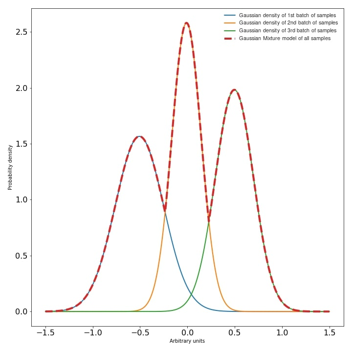
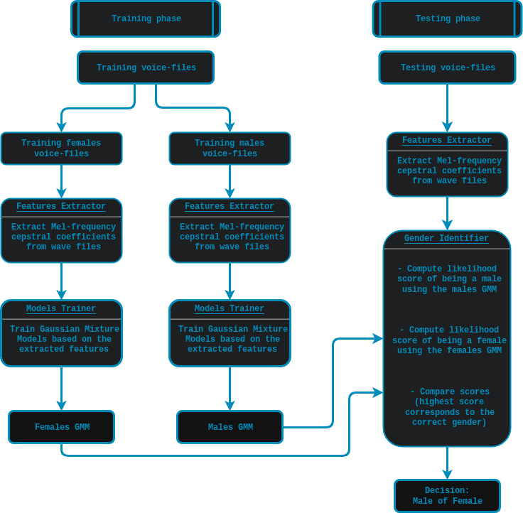

# Voice-based-gender-recognition
Voice based gender recognition using:
  - **The Free ST American English Corpus dataset (SLR45)**
  - **Mel-frequency cepstrum coefficients (MFCC)**
  - **Gaussian mixture models (GMM)**
## Dataset
The  **The Free ST American English Corpus dataset (SLR45)**  can be found on [SLR45](http://www.openslr.org/45/). It is a free American English corpus by [Surfingtech](www.surfing.ai), containing utterances from 10 speakers (5 females and 5 males). Each speaker has about 350 utterances.

## Theory

#### Voice features extraction
The Mel-Frequency Cepstrum Coefficients (MFCC) are used here, since they deliver the best results in speaker verification.
MFCCs are commonly derived as follows:
1. Take the Fourier transform of (a windowed excerpt of) a signal.
2. Map the powers of the spectrum obtained above onto the mel scale, using triangular overlapping windows.
3. Take the logs of the powers at each of the mel frequencies.
4. Take the discrete cosine transform of the list of mel log powers, as if it were a signal.
5. The MFCCs are the amplitudes of the resulting spectrum.

#### Gaussian Mixture Model
According to D. Reynolds in [Gaussian_Mixture_Models](https://pdfs.semanticscholar.org/734b/07b53c23f74a3b004d7fe341ae4fce462fc6.pdf):
A Gaussian Mixture Model (GMM) is a parametric probability density function represented as a weighted sum of Gaussian component densities. GMMs are commonly used as a parametric model of the probability distribution of continuous measurements or features in a biometric system, such as vocal-tract related spectral features in a speaker recognition system. GMM parameters are estimated from training data using the iterative Expectation-Maximization (EM) algorithm or Maximum A Posteriori(MAP) estimation from a well-trained prior model.
<p align="center">
  
</p>

To train a Gaussian mixture models based on some collected features, you can use scikit-learn-library specifically the scikit-learn-gmm:
```python
#GmmGeneration.py
 import os
 import pickle
 from sklearn.mixture import GMM
 
 
 def save_gmm(gmm, name):
     """ Save Gaussian mixture model using pickle.
         Args:
             gmm        : Gaussian mixture model.
            name (str) : File name.
    """
    filename = name + ".gmm"
    with open(filename, 'wb') as gmm_file:
        pickle.dump(gmm, gmm_file)
    print ("%5s %10s" % ("SAVING", filename,))

...
# get gender_voice_features using FeaturesExtraction
# generate gaussian mixture models
gender_gmm = GMM(n_components = 16, n_iter = 200, covariance_type = 'diag', n_init = 3)
# fit features to models
gender_gmm.fit(gender_voice_features)
# save gmm
save_gmm(gender_gmm, "gender")
```


#### Workflow graph
<p align="center">
  
</p>

# Data Formatting 
 Once you download your data-set, you will need to split it into two different sets:

    Training set: This set will be used to train the gender models.
    
    Testing set: This one will serve for testing the accuracy of the gender recognition.

I usually use 2/3 of the the data for the training and 1/3 for the testing, but you can adjust that to your needs/ wishes. The code provides an option for running the whole cycle using "Run.py" or you can go step by step and for the data management just run the following in your terminal:

#Voice features extraction
The Mel-Frequency Cepstrum Coefficients (MFCC) are used here, since they deliver the best results in speaker verification . MFCCs are commonly derived as follows:

      1. Take the Fourier transform of (a windowed excerpt of) a signal.
      
      2. Map the powers of the spectrum obtained above onto the mel scale, using triangular overlapping windows.
      
      3. Take the logs of the powers at each of the mel frequencies.
      
      4. Take the discrete cosine transform of the list of mel log powers, as if it were a signal.
      
      5. The MFCCs are the amplitudes of the resulting spectrum.

To extract MFCC features I usually use the python_speech_features library, it is simple to use and well documented:
```python
#FeaturesExtraction.py
  import numpy as np
  from sklearn import preprocessing
  from scipy.io.wavfile import read
  from python_speech_features import mfcc
  from python_speech_features import delta
 
  def extract_features(audio_path):
      """
      Extract MFCCs, their deltas and double deltas from an audio, performs CMS.

     Args:
         audio_path (str) : path to wave file without silent moments.
     Returns:
         (array) : Extracted features matrix.
     """
     rate, audio  = read(audio_path)
     mfcc_feature = mfcc(audio, rate, winlen = 0.05, winstep = 0.01, numcep = 5, nfilt = 30,
                         nfft = 512, appendEnergy = True)

     mfcc_feature  = preprocessing.scale(mfcc_feature)
     deltas        = delta(mfcc_feature, 2)
     double_deltas = delta(deltas, 2)
     combined      = np.hstack((mfcc_feature, deltas, double_deltas))
 return combined
```

# Gender identification:
The identification is done over three steps: first you retrieve the voice features, then you compute their likelihood of belonging to a certain gender and finally your compare both scores and make a decision on the probable gender. The computation of the scores is done as follows


## Dependencies
This script require the follwing modules/libraries:
* [numpy](http://www.numpy.org/) & [scipy](https://www.scipy.org/) & [scikit-learn](https://scikit-learn.org/stable/) & [python_speech_features](https://github.com/jameslyons/python_speech_features)

Libs can be installed as follows:
```
pip install -r requirements.txt
```
## Code & scripts
- [Run.py](Run.py) : This is the main script and it will run the whole cycle (Data management > Models training > Genders identification)
- [DataManager.py](Code/DataManager.py): This script is responsible for the extracting and strcturing the data.
- [ModelsTrainer.py](Code/ModelsTrainer.py):This script is responsible for training the Gaussian Mixture Models (GMM).
- [GenderIdentifier.py](Code/GenderIdentifier.py):This script is responsible for Testing the system by identifying the genders of the testing set.
- [FeaturesExtractor.py](Code/FeaturesExtractor.py):This script is responsible for extracting the MFCC features from the .wav files.

## Results and disscussion
- The system results in a **95%** accuracy of gender detection.
- The code can be further optimized using multi-threading, acceleration libs and multi-processing.
- The accuracy can be further improved using GMM normalization aka a UBM-GMM system.
